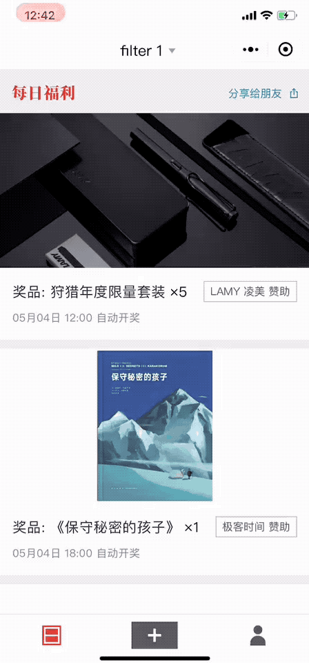
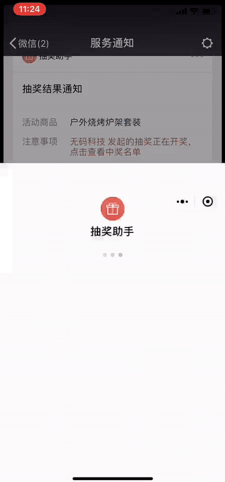
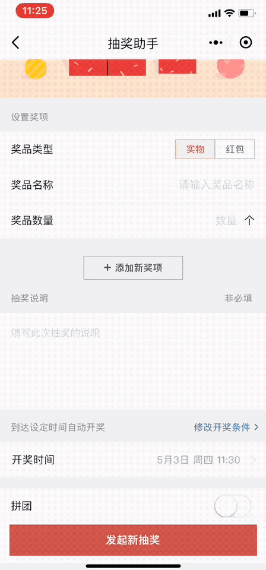

# 小程序自定义导航栏

小程序默认导航栏的一些遇到的问题：

- Andorid 和 IOS 风格不统一，样式自定义选项少，无法满足设计需求。
- 回到首页的按钮在的二级菜单中，影响用户的留存。
- 导航栏无法加入额外的功能，空间浪费。
- ...

微信版本 `6.6.0` 新增[配置项](https://developers.weixin.qq.com/miniprogram/dev/framework/config.html) `navigationStyle`, 支持全屏显示小程序，自定义导航栏就由此得以实现。

由于 `navigationStyle` 配置是全局配置，一旦设置成 `custom` 后，小程序所有页面的默认导航栏都将消失。因此在所有小程序页，都需要实现自定义导航栏样式及其基本的导航功能（返回上一页，回到首页），通常会封装成一个组件。

## 可用性检测

在配置 `navigationStyle` 为 `custom` 后，请确保微信版本 `6.6.0` 上才渲染自定义的导航栏组件。

## 导航功能

可通过 `getCurrentPages()` 获取当前的页面栈，选择何时的导航按钮进行显示。(这个 Api 只在微信官方文档 wx.navigateBack 这个接口文章中有粗略的提及)

## 导航栏和内容区布局

布局时，需要考虑状态栏高度。状态栏高度可以通过 `systemInfo.statusBarHeight` 获得 (只在小程序基础库版本 1.9.0 以上可用)，因此需要做兼容性处理。

## 示例

[代码示例](https://github.com/alexayan/wepy-layout)

|filter |home           |cancel                           |
| ------ | ---------------- | ------------------------------------- |
|  |  |  |
