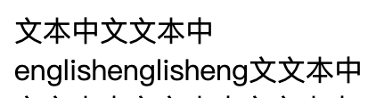

# 两端对齐排版优化

通过如下 css 可以很容易使文本段落两端对齐

```css
.justify{
  text-align: justify;
  word-wrap: break-word;
}
```

但是，如果段落内包含中英文，并且存在过长的英文单词导致文本换行。这时候，段落中某些行中的文字间距会拉的很大


而我们期望的是如下的效果



总结为排版规则，即为：

> 段落中的每一行，如果剩余的空白空间大于 n 个字符宽带，则当前行向左对齐，否则两端对齐。

### 排版规则优化

无论是在游览器环境，还是小程序环境，想要对段落中的每一行独立应用排版规则，需要先通过程序进行分行（根据段落宽度，计算每一行容纳的字符）。

精确的分行，需要使用 canvas 来测量文本的宽度，但是在小程序端，canvas 接口调用的耗时比较长，并且是同步调用，如果大量文本进行测量会长时间阻塞 Javascript 主线程，因此在小程序端的适用范围比较小。

为了避免进行段落分行计算，可以放宽对每一行应用两端对齐排版规则，改为：

> 如果段落内存在空白空间大于 n 个字符宽度的行，则不使用两端对齐。否则对整个段落应用两端对齐。

这样可以避免出现文字间距拉的很大这种不可接受的情况，并且保证大多数情况下，段落内的每一行能两端对齐。

### 排版规则实现

排版规则实现的难点是：如何判断段落内是否存在空白空间大于 n 个字符宽度的行。

下面描述了一种算法实现方式：

1. 首先通过对段落文本进行分词，分离连续的 CJK 字符和非 CJK 字符，并在非 CJK 字符串前后添加 flag 标记。

2. 对分词后的内容进行渲染，flag 标记作为空文本元素进行渲染，不占宽度。

3. 渲染后，获取每个 flag 元素的布局位置信息，连续 2 个 flag为一对。分别比较每一对 flag 元素，如果两个 flag 元素不在同一行，则：`空白空间宽度 = 段落宽度 - 每对第一个 flag 元素的左边界坐标`，如果 `空白空间宽度`大于 n 个字符宽度，则不对段落进行两端对齐。

#### 分词算法

```
export function splitCJKWord(texts) {
  const nCJK = /([^\u31c0-\u31ef\u3000-\u303f\uff00-\uffef\u2e80-\u2eff\u2f00-\u2fdf\u3040-\u309f\u30a0-\u30fa\u30fc-\u30ff\u3100-\u312f\u3200-\u32ff\u3400-\u4dbf\u4e00-\u9fff\uf900-\ufaff]+)/g;
  let rtn = [];
  let lastIndex = 0;
  let match;
  do {
    match = nCJK.exec(texts);
    let leftStr;
    let matchStr;
    if (match) {
      leftStr = texts.slice(lastIndex, match.index);
      matchStr = match[0];
    } else {
      leftStr = texts.slice(lastIndex);
    }
    if (leftStr) {
      rtn.push({
        text: leftStr,
        type: 'cjk'
      })
      lastIndex += leftStr.length;
    }
    if (matchStr) {
      rtn.push({
        text: '',
        type: 'flag'
      });
      rtn.push({
        text: matchStr,
        type: 'ncjk'
      });
      rtn.push({
        text: '',
        type: 'flag'
      });
      lastIndex += matchStr.length;
    }
  } while (match);
  return rtn;
}
```

#### 小程序内获取 flag 元素位置信息，并判断是否应用两端对齐规则

```javascript
const query = wx.createSelectorQuery()
query.selectAll('.flag').boundingClientRect()
query.exec((res) => {
  const items = res[0];
  let leftFlag = null;
  let rightFlag = null;
  let needJustify = true;
  for (let i = 0, len = items.length; i < len; i++) {
      if (i % 2 === 0) {
         leftFlag = items[i];
         continue;
      }
      rightFlag = items[i];
      if (leftFlag.height && rightFlag.height && leftFlag.top !== rightFlag.top) {
        if (paragraphWidth - leftFlag.left > 17 * 3) {
            needJustify = false;
          	break;
        }
      }
  }
  this.setData({
      needJustify
  })
})
```

