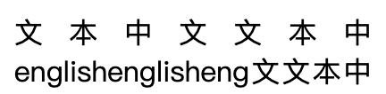

# 两端对齐排版优化

通过如下 css 可以很容易使文本段落两端对齐

```css
.justify{
  text-align: justify;
  word-wrap: break-word;
}
```

但是，如果段落内包含中英文，并且存在过长的英文单词导致文本换行。这时候，段落中某些行中的文字间距会拉的很大



而我们期望的是如下的效果


## 排版规则

> 如果段落中有一行，其剩余的空白空间大于 n 个字符宽带，则当前行和其前面的行合并为独立段落，并应用 css 两端对齐。

## 排版规则实现

排版规则实现的难点是：如何判断段落内是否存在空白空间大于 n 个字符宽度的行。

下面描述了一种不依赖 canvas 的实现方式：

1. 首先通过对段落文本进行分词，分离连续的 CJK 字符和非 CJK 字符，并在非 CJK 字符串前后添加 flag 标记。

2. 对分词后的内容进行渲染，flag 标记作为空文本元素进行渲染，不占宽度。

3. 渲染后，获取每个 flag 元素的布局位置信息，连续 2 个 flag为一对。分别比较每一对 flag 元素，如果两个 flag 元素不在同一行，则：`空白空间宽度 = 段落宽度 - 每对第一个 flag 元素的左边界坐标`

### 分词算法

```
export function splitCJKWord(texts) {
  const nCJK = /([^\u2e80-\u2eff\u2f00-\u2fdf\u3040-\u309f\u30a0-\u30fa\u30fc-\u30ff\u3100-\u312f\u3200-\u32ff\u3400-\u4dbf\u4e00-\u9fff\uf900-\ufaff\s-,，、。?？!！;；:：>》」）】]+)/g;
  let rtn = [];
  let lastIndex = 0;
  let match;
  do {
    match = nCJK.exec(texts);
    let leftStr;
    let matchStr;
    if (match) {
      leftStr = texts.slice(lastIndex, match.index);
      matchStr = match[0];
    } else {
      leftStr = texts.slice(lastIndex);
    }
    if (leftStr) {
      rtn.push({
        text: leftStr,
        type: 'cjk'
      })
      lastIndex += leftStr.length;
    }
    if (matchStr) {
      const prevWord = rtn[rtn.length - 1];
      let needHideAfterJustify = false;
      if (prevWord && prevWord.text[prevWord.text.length - 1] === ' ') {
        needHideAfterJustify = true;
      }
      rtn.push({
        text: '',
        type: 'flag',
        needHideAfterJustify
      });
      rtn.push({
        text: matchStr,
        type: 'ncjk'
      });
      rtn.push({
        text: '',
        type: 'flag'
      });
      lastIndex += matchStr.length;
    }
  } while (match);
  return rtn;
}
```

### 具体实现

小程序环境：[https://github.com/alexayan/mina-beautiful-paragraph](https://github.com/alexayan/mina-beautiful-paragraph)